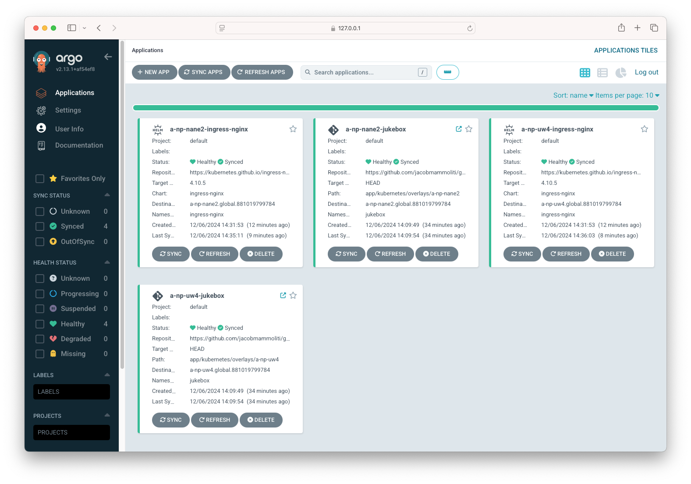

# GKE Demo

This repository is used to demo GKE and various GKE Enterprise components.

## Deploy GKE clusters and Register them to GKE Hub via Terraform

```bash
cd terraform/0_cluster_builds

terraform init

terraform apply
```

## Deploy ArgoCD to the Control Cluster and Enable the ArgoCD Fleet Plugin

Set required environment variables:

```bash
export FLEET_PROJECT_ID=loudly-close-akita
export CONTROL_REGION=northamerica-northeast2
export FLEET_PROJECT_NUMBER=881019799784
export FLEET_SA="argocd-fleet-admin@$FLEET_PROJECT_ID.iam.gserviceaccount.com"
export PATH_TO_IMAGE=$CONTROL_REGION-docker.pkg.dev/$FLEET_PROJECT_ID/argocd-fleet-sync/plugin:v1.0
```

Authenticate to Control cluster (this is where ArgoCD will be deployed):

```bash
gcloud container clusters get-credentials c-np-nane2 --region $CONTROL_REGION --project $FLEET_PROJECT_ID

# Required on VPN
kubectl config set-cluster $(kubectl config current-context) --insecure-skip-tls-verify=true
```

Deploy ArgoCD to Control Cluster:

```bash
kubectl create namespace argocd
kubectl apply -n argocd -f https://raw.githubusercontent.com/argoproj/argo-cd/stable/manifests/install.yaml
```

Configure the Fleet ArgoCD Plugin:

```bash
cd gke-fleet-management/fleet-argocd-plugin

gcloud builds submit --region=$CONTROL_REGION --config=cloudbuild.yaml --project $FLEET_PROJECT_ID

# Annotate the Kubernetes ServiceAccount so that GKE sees the link between the service accounts.
kubectl annotate serviceaccount argocd-application-controller --namespace argocd iam.gke.io/gcp-service-account=argocd-fleet-admin@$FLEET_PROJECT_ID.iam.gserviceaccount.com

envsubst '$FLEET_SA $FLEET_PROJECT_NUMBER $PATH_TO_IMAGE' < fleet-sync-install.yaml | kubectl apply -f - -n argocd
```

Retrieve the initial ArgoCD admin password and port-forward the ArgoCD service:

```bash
kubectl get secret -o yaml argocd-initial-admin-secret  -n argocd -o jsonpath={'.data.password'} | base64 -d

kubectl port-forward svc/argocd-server 8000:80 -n argocd
```

Deploy the ArgoCD ApplicationSets:

```bash
envsubst '$FLEET_PROJECT_NUMBER' < nginx-applicationset.yaml | kubectl apply -f - 

envsubst '$FLEET_PROJECT_NUMBER' < jukebox-applicationset.yaml | kubectl apply -f - 
```

To ignore the CiliumIdentity difference in ArgoCD, add the following the `argocd-cm` Config Map:

```yaml
data:
  resource.exclusions: |
    - apiGroups:
      - cilium.io
      kinds:
      - CiliumIdentity
      clusters:
      - "*"
```

Once everything is deployed, you will see the NGINX Ingress Controller and your application deployed in both clusters:

